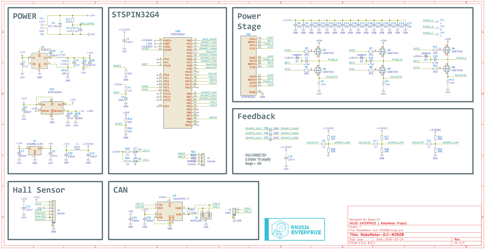
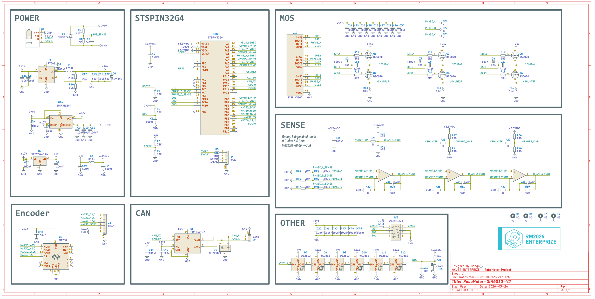
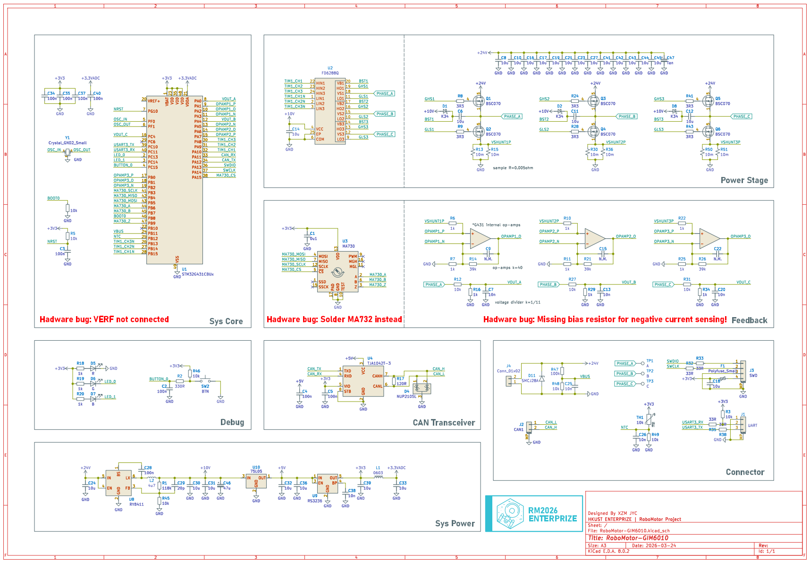

# RoboMotor Hardware
# Open-sourced FOC Driver PCB

All projects are designed with Kicad 8.

## Project List

|Name|Target Motor|Description|MCU/Chip|
|:--|:--|:--|:--|
|RoboMotor-DJI-M3508|[DJI M3508](https://www.robomaster.com/en-US/products/components/general/M3508)|6 Layer, High power density|STSPIN32G4|
|RoboMotor-GIM6010-V2|[GIM6010-8](https://steadywin-motor.com/products/built-in-star-gear-motor-motor-robot-joint-driver-actuator-controller-motor)|Support gear box output encoder|STSPIN32G4|
|RoboMotor-GIM6010-V2-Encoder|GIM6010-8|PCB of the output encoder|MA730|
|RoboMotor-GIM6010|GIM6010-8|Old version, reference only|STM32G431 + FD6288|

### RoboMotor-DJI-M3508

- Operating conditions: 24V, max 20A.
- MCU: STSPIN32G4. With integrated buck, LDO, Mosfet drivers and STM32G431 MCU.
- 6 Layer PCB, separate analog sampling circuit and power stage signals.
- Supports Sin/Cos encoder and CAN communication. Fully compatible with [DJI C620](https://www.robomaster.com/en-US/products/components/general/M3508) ESC.

Schematic:

### RoboMotor-GIM6010-V2

- Operating conditions: 24V, max 40A.
- MCU: STSPIN32G4. With integrated buck, LDO, Mosfet drivers and STM32G431 MCU.
- Encoder: MA732 magnetic encoder
- 4 Layer PCB.
- Supports MA732 magnetic encoder, second encoder after gear box and CAN communication. Specifically designed for [GIM6010-8](https://steadywin-motor.com/products/built-in-star-gear-motor-motor-robot-joint-driver-actuator-controller-motor) motor with 8:1 reduction ratio.

Schematic:

### RoboMotor-GIM6010
Lagecy version, for reference only.

- Operating conditions: 24V, max 40A.
- MCU: STM32G431CBU6. Mosfet driver: FD6288.
- Encoder: MA732 magnetic encoder
- 4 Layer PCB.
- Supports MA732 magnetic encoder, second encoder after gear box and CAN communication. Specifically designed for [GIM6010-8](https://steadywin-motor.com/products/built-in-star-gear-motor-motor-robot-joint-driver-actuator-controller-motor) motor with 8:1 reduction ratio.

Schematic:

